# B1-2 AI로 글, 그림, 영상 만들어 나만의 광고 만들기 — toCatter

---

# 브랜드 아이덴티티

- **브랜드명**: toCatter - cat together
- **제품**: 고양이 캣닙 음료 toCatter (캔형)
- **타겟**: 반려묘를 가족 구성원으로 여기는 반료동물가구
- **톤앤매너**: 귀여움과 유머러스함
- **USP**: 많은 것을 함께 하는 반려 고양이에게 음료형 간식을 제공함으로서, 음료수를 마시며 즐거운 시간을 보내는 경험을 공유
- **핵심 메시지**: "고양이도 가족이니까"

# 사용 도구 목록

# 사용 도구 목록

| 용도 | 도구명 | 생성방식 | 선정 이유 | 대체도구 |
|------|--------|------|-----------|------|
| 기획, 음성파일 추출 | Claude | text to text | 지시 이행·추론 능력이 우수하여 아이디어 구체화와 프롬프트 반복 개선에 활용 | ChatGPT, Gemini |
| 이미지(생성) | Midjourney | text to image | 크리에이티브 업계 표준. ow 등 다양한 파라메터를 통한 일관성 유지 | Ideogram, Adobe Firefly, Leonardo AI |
| 이미지(정밀 생성·합성)1 | Gemini (mac/ios앱) | text to image (로고, 제품) | 이해 기반 편집 — 로고-제품 생성과 합성 일괄 처리에 유리 | ChatGPT(GPT Image), Ideogram |
| 이미지(편집/합성)2 | Gemini | image+text to image | 이해 기반 편집 — 로고-제품 합성, 이미지 편집 | ChatGPT, Adobe Firefly(생성형 채우기) |
| 이미지(편집/합성)3 | Claude | image+text to image | 로고 크롭 등 별도의 마커가 없어서 유리 | Photopea, GIMP |
| 영상 | Kling (웹/mac) | image to video | I2V 변환에서 temporal stability가 뛰어남 | Runway Gen-3, Luma Dream Machine, Hailuo(MiniMax) |
| 보이스 생성 | ElevenLabs | voice design | 캐릭터 보이스를 텍스트 서술로 직접 설계 가능 | Typecast, Supertone |
| 나레이션/대사1 | ElevenLabs | tts | 감정 표현력과 자연스러운 톤 | Typecast, Supertone, Google Cloud TTS |
| 나레이션/대사2 (캐릭터 대사) | Kling | image+text to video | 자체 생성 영상에 최적합한 립싱크 | HeyGen, Hedra, Runway Act-One |
| 나레이션/대사3 | ElevenLabs | voice change (audio to audio) | 원본 억양·타이밍 유지한 목소리 변환 | Respeecher, Supertone Shift |
| 효과음 | ElevenLabs | text to sound effect | 음성 분야 높은 위상, 충분한 무료크레딧 | Stable Audio, Freesound(비AI) |
| 음악 | Suno | text to music | 음악생성 AI 중 보편성 최고 | Udio, Stable Audio, Mubert |
| 영상 편집 | CapCut (무료) | 편집 | 컷 편집·오디오 믹싱·자막 통합 처리 | DaVinci Resolve, Adobe Premiere |

---

## 결과 파일명 기준

  asset or scene_종류_설명_원본시도번호_수정번호


# 에셋


## 고양이

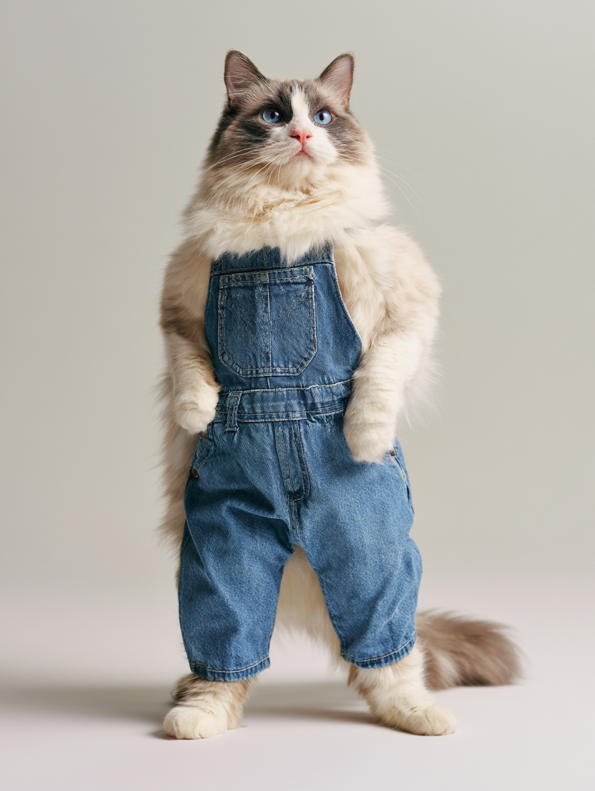

도구: 미드저니

**출력 결과 요약**: 광고의 핵심이될 귀여운 고양이
 
 **결과 파일명**: asset_img_cat_01.png

파라메터 :ar 3:4, raw, stylize 130, weird 0

### 프롬프트
```
hyperrealistic photograph of an anthropomorphic ragdoll cat standing upright on two legs, gray bicolor coat with soft gray markings on the head and ears, creamy white face blaze, chest, arms and paws in uniform solid cream white, long fluffy silky fur, striking blue eyes, pink nose, wearing blue denim overalls, alert curious expression looking at camera, natural relaxed posture with weight on one leg and one paw slightly raised, full body, plain light gray studio background, soft warm natural lighting, shot on 85mm lens, shallow depth of field, cinematic advertising photography --ar 3:4 --style raw --stylize 130 --weird 0
```

## 가족들

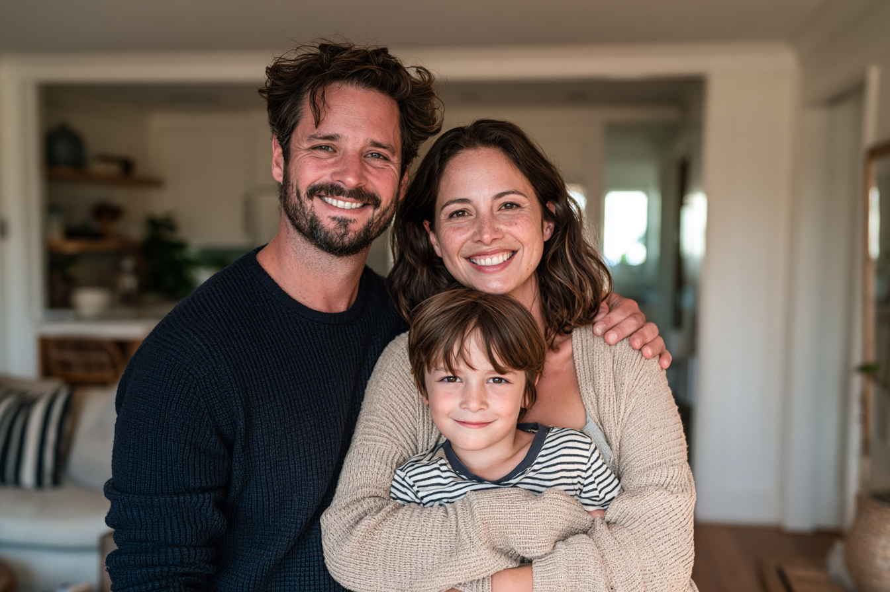

도구: 미드저니

**출력 결과 요약**: 광고에 필요한 행복하고 화목해 보이는 가족의 모습
 
 **결과 파일명**: asset_img_family_01.png

### 프롬프트

파라메터: ar 3:2  raw  stylize 120 weird 0

```
photorealistic candid family portrait, American family of three in a bright modern living room, father in his late 30s wearing a casual navy sweater, mother in her mid 30s wearing a beige cardigan, 7 year old boy in a striped t-shirt, cinematic advertising photography, soft warm key light, shallow depth of field
--ar 3:2  --raw  --stylize 120 
```

## 로고

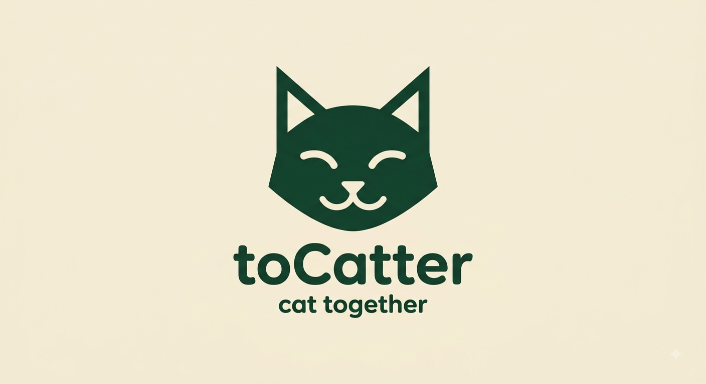)

도구: Gemini,Claude(크롭)

**출력 결과 요약**: 광고 최후반과 캔에 표시될 로고
 
 **결과 파일명**: asset_img_logo_01_01.png

### 프롬프트
```
Minimal flat vector logo for a cat beverage brand. A single stylized cat head facing forward, geometric simplified shapes, pointed triangular ears, calm friendly closed-eye expression, bold solid silhouette with negative-space eyes. Below the mark, brand name "toCatter" in clean rounded sans-serif, and a smaller tagline "cat together" underneath. Two-color design: deep forest green mark on warm cream background. Centered, sharp edges, high contrast, no gradients, no photorealism, no extra text.
```

이후 

claude로 제미나이 마크 크롭

## 제품

도구: Gemini

**출력 결과 요약**: 로고가 잘 인쇄된 캔
 
 **결과 파일명**: asset_img_product_01_01.png

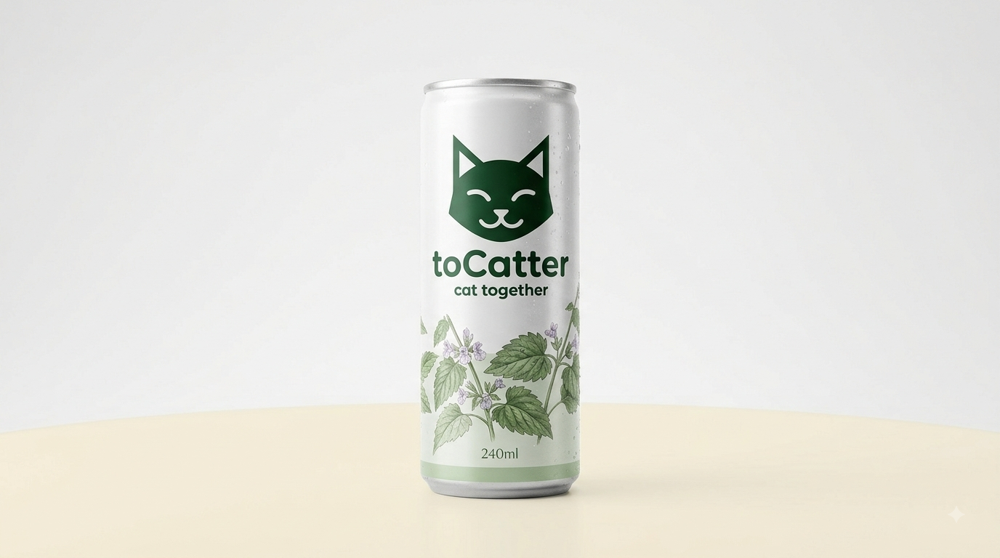

### 프롬프트

```
Photorealistic product shot of a slim 240ml aluminum beverage can, Korean botanical drink packaging style. Clean white and brushed silver base with a soft green accent band near the bottom. Detailed illustration of catnip leaves and small pale purple catnip flowers wrapping around the lower half. Vertical typography reading "toCatter" on the upper portion. Minimal retro herbal-beverage aesthetic. Clean white studio background, soft diffused lighting, subtle condensation droplets, centered composition, commercial product photography.
프롬프트:Photorealistic product shot of a slim 240ml aluminum beverage can, Korean botanical drink packaging style. Clean white and brushed silver base with a soft green accent band near the bottom. Detailed illustration of catnip leaves and small pale purple catnip flowers wrapping around the lower half. Vertical typography reading "toCatter" on the upper portion. Minimal retro herbal-beverage aesthetic. Clean white studio background, soft diffused lighting, subtle condensation droplets, centered composition, commercial product photography. 
```

### 편집 프롬프트

```
로고와 제품은 같은 세션에서 생성 되었습니다.
... 
Apply the attached logo onto the upper label area of this can. Keep the can's shape, lighting, reflections, and botanical illustration unchanged. The logo should follow the curvature of the can surface naturally and stay fully legible.
```

출력 결과: 로고가 잘 인쇄된 캔

## 나레이션 보이스 - 중년 남성 목소리

도구:elevelabs

**출력 결과 요약**: 출력 결과:나레이션을 담당할 중년 성우 목소리

 **결과**: asset_voice_01(파일이 아닌 툴에서 사용 가능한 에셋)

### 프롬프트
```
Native korean. Male, 35–40,Broadcast quality(tv advertisement)
Persona:narrator for humanistic documentary . Emotion:encouraging,smooth ,little low, middle-aged
this is voice for advertise environmentally friendly product
```

### 캐릭터 보이스 - 고양이 목소리

도구:elevelabs

**출력 결과 요약**: 고양이 립싱크에 쓰일 귀여운 캐릭터 목소리
 
 **결과**: asset_voice_02(파일이 아닌 툴에서 사용 가능한 에셋)
 
### 프롬프트

```
An animated cartoon character voice for a family advertisement, high-pitched and light with a soft airy quality, slightly nasal, 
playful and expressive, curious and a little plaintive, gentle and small in scale, warm cartoon timbre with a soft whine at the end of phrases
```

## bgm

- **출력 결과 요약**: 출력 결과 요약:광고에 어울리는 경쾌한 컨트리풍의 음악 약 10초분량
- **결과 파일명**: [asset_bgm_01.mp3](./asset_bgm/asset_bgm_01.mp3)

도구:suno

**styles(프롬프트)**

```
upbeat country advertising jingle, 100 BPM, acoustic guitar strumming, banjo, light hand claps, tambourine, warm and cheerful, simple repeating 4-bar phrase, clean loop, bright major key, no vocals, commercial background music

[Intro - 4 bars]
[Main Loop - 4 bars]
[Main Loop repeat - 4 bars]
[Main Loop repeat - 4 bars]
[Outro - 2 bars]
```

---

# 스토리보드 (총 10초 / 4컷)

## 목적
고양이용 음료를 함께하는 시간을 가족으로 더 가깝게 느낄수 있는 가치를 전달한다.

## 프롬프트 정리

	- 대화형 편집은 일부 내용 생략
	- 이미지와 비디오는 씬에 수록
	- 효과음 프롬프트는 효과음 부분 참고
	- 에셋을 그대로 사용한 부분들 에셋 참고

---

## 씬 1 (일상 — 가족들이 함께 음료를 마신다)

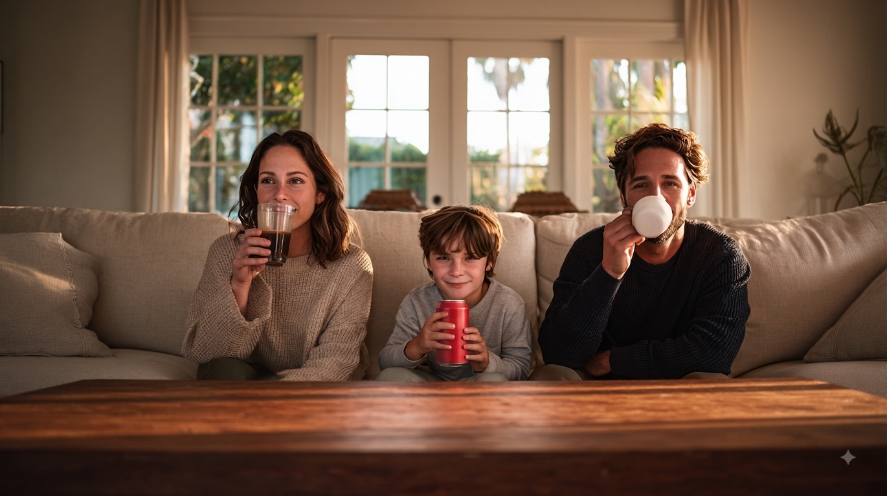

- **길이**: 3초
- **목표 메시지**: 음료를 함께하는 가족의 모습을 통해 음료가 가정에서 가지는 공유의 가치를 부각한다.
- **화면 구성**: 소파에 함께 앉은, 아빠·엄마·아들이 각자 다른 음료를 마심. 세 명이 한 프레임에 자연스럽게 배치.
- **나레이션**: "가족들이 모이면 모두 좋아하는 음료수를 함께 즐기죠(중년 남성 asset_voice_01)"
- **효과음**: 없음
- **사용 도구 및 목적**: 
	-이미지: 미드 저니(시작 이미지 생성), 제미나이(아이의 캔의 로고 제거)
	-비디오: kling(영상생성)
	-나레이션/대사: elevenlabs
	-오디오:suno(bgm)
  **결과 파일명:** scene_img_family_02_01.png/asset_bgm_01.mp3/
- **이미지 프롬프트**:
### 프롬프트

asset_img_family_01.png를 기반으로 아래 프롬프트 입력 ow를 도입하여 

```
photorealistic candid living room scene, American family of three relaxing on a beige sofa, low wooden coffee table in front of them, mother on the left lifting a tall clear glass of iced coffee to her lips mid-sip, father on the right drinking from a white ceramic mug, young boy in the middle tilting a red soda can up to drink, all three looking away from the camera in different directions, unposed natural moment, medium shot filling the frame, warm golden afternoon light through the window, cinematic advertising photography, shot on 50mm lens --ar 16:9  --raw  --ow 100  --stylize 120 
```

파라메터: ar 16:9  raw  stylize 120  weird 0 ow 100

결과 요약:일관성이 조금 부족한 이미지

구도등은 원하는 봐에 근사하나 

아동 캐릭터와의 유사성이 떨어지는 것 같아서 유사성과 관련된 파라미터인 ow를 표준적인 범위 안에서 상향 하였습니다.

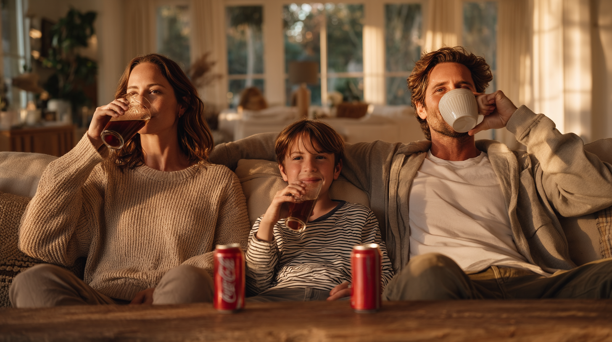

결과 파일명: asset_img_family_01.png

### 수정프롬프트
```

photorealistic candid living room scene, American family of three relaxing on a long beige sectional sofa that extends to the right side of the frame, low wooden coffee table running parallel along the full width of the frame, completely bare polished tabletop with nothing placed on it, empty sofa seat and empty table space to the right of the father, mother on the left lifting a tall clear glass of iced coffee to her lips mid-sip, young boy with shaggy brown hair and freckles in the middle tilting a red soda can up to his mouth drinking, father on the right drinking from a white ceramic mug, each person holding exactly one drink and nothing else, all three looking away from the camera in different directions, unposed natural moment, wide medium shot, warm golden afternoon light through the window, cinematic advertising photography, shot on 50mm lens
--ar 16:9 
--raw 
--ow 400 
--stylize 120 

``` 

파라메터: ar 3:2  raw  stylize 120 weird 0 ow 400

결과 파일명: asset_img_family_01_02.png
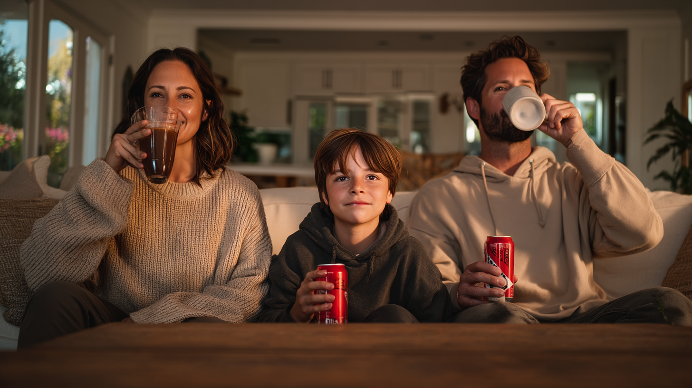

이후 위의 이미지 제미나이를 통해 아동이 가진 캔의 로고를 제거

결과 요약 : 영상제작에 쓰일 수 있는 가족이 음료를 공유하는 장면 로고도 제거

결과 파일명: scene_img_family_02_01.png


- **비디오 프롬프트**: `each family member sips their drink naturally, subtle head and hand movements, warm light, static camera`
- **출력 결과 요약**: 
- **결과 파일명**:

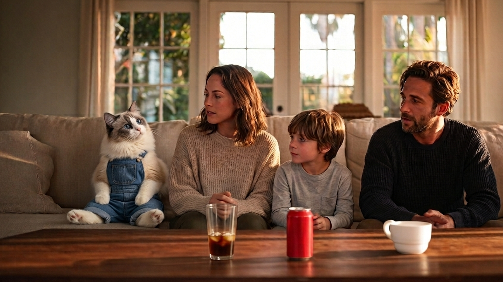

## 씬 2 (문제 — 고양이 등장 나는? )
- **길이**: 2초
- **목표 메시지**: 소외의 순간. 이 광고의 감정 코어
- **화면 구성**: 같은 식탁 옆, 고양이 클로즈업. 고개를 갸우뚱하며 가족 쪽을 바라봄. 앞에는 아무것도 없음
- **나레이션/대사**: "나는?"
- **효과음**: 정적 (음악 잦아듦)
- **사용 도구**: MJ 또는 Gemini(고양이 oref) → Kling
- **출력 결과 요약**:
- **결과 파일명**:
- **이미지 프롬프트**:
```
photorealistic close-up of an anthropomorphic ragdoll cat sitting beside a dining table, head tilted to one side with a questioning expression, looking toward the family off-frame, nothing in front of the cat, warm golden afternoon light, shallow depth of field, cinematic advertising photography --ar 16:9 --style raw --stylize 120
```
  (+ oref: 고양이 캐논, 슬라이더 80)
- **비디오 프롬프트**: `cat tilts its head slowly to one side, ears twitch, blinks once, minimal camera movement`
- **출력 결과 요약**:
- **결과 파일명**:

## 씬 3 (전환 ・ 해결/제안 — 따라준다)

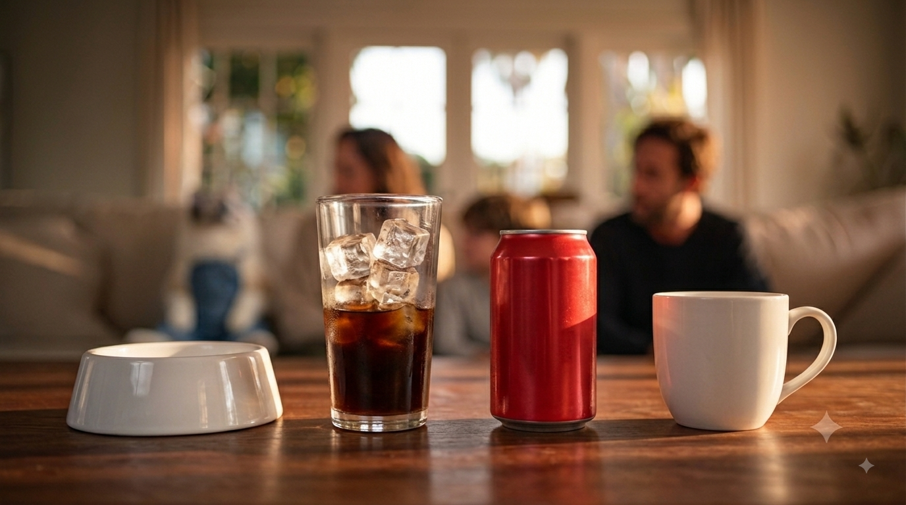

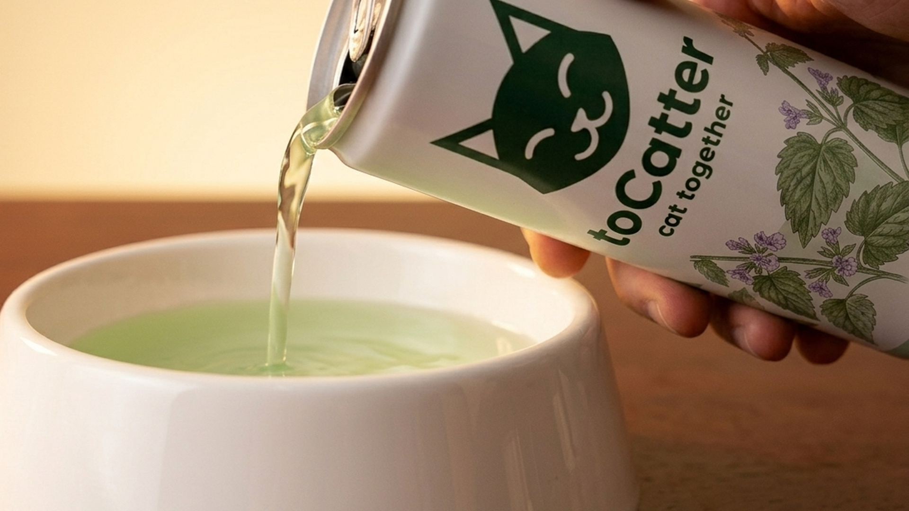


- **길이**: 3초
- **목표 메시지**:제품이 등장하고 문제를 해결  나레이션을 통해서 직접적으로 제품의 가치와 제품/브랜드명을 전달한다.
- **화면 구성**: 장면전환 클로즈업 된 식탁위의 음료수용기들 고양이를 우한 물그릇이 같이 있음. 사람 손이 toCatter 캔을 기울여 고양이 물그릇에 따름. 프레임 안에 손·캔·그릇만 (캔 라벨이 정면으로 읽혀야 함).
- **나레이션/대사**: "고양이도 가족이니까(중년 남성 asset_voice_01)".","투 캐터(중년 남성 asset_voice_01)"
- **효과음**:bgm(asset_bgm_01.mp3) 다시 시작, 음료 찰랑 거리는 소리(scene_snd_fiz_01.wav), 음료 따르는 소리(scene_snd_pour_01.wav)
- **사용 도구 및 목적**: 
	-이미지: 제미나이(이미지 편집을 통해서 시작프레임,마지막 프레임 생성)
	-비디오: kling(영상생성)
	-나레이션/대사: elevenlabs
	-오디오: suno(bgm),elevenlabs(효과음)
- **출력 결과 요약**: 
- **결과 파일명**: [scene_vid_scene3_02_13](./story_board.md#프롬프트-7)/[scene_img_fmaily_02_09](./story_board.md#편집프롬프트-1)/[scene_img_family_02_13](./story_board.md#편집프롬프트-2)//[asset_bgm_01.mp3](./story_board.md#bgm)/[scene_snd_fiz_01.wav](./story_board.md#캔안의-음료가-찰랑-거리는-소리)/[scene_snd_pour_01.wav](./story_board.md#음료-따르는-소리)
- **이미지 프롬프트**:
### 편집프롬프트 1

도구:Gemini

scene_img_family_02_06.png 를 편집하였습니다.


```
....

Edit this image only. Zoom in on the wooden coffee table so it fills the frame, showing the three drinks from a close, low angle. The family and the cat are visible only as a soft blur in the background.

The tall glass contains dark brown iced coffee, the color of black coffee with only a small amount of milk, filled to about half the glass with ice cubes visible above the liquid line. Keep this exact color and level — do not make it lighter or fuller.

The red can and the white ceramic mug stay exactly as they are.

Add a white ceramic pet bowl on the table to the left of the three drinks, so all four containers are lined up in a row. Keep the warm golden lighting and the 16:9 aspect ratio.
```


이후 claude로 제미나이 로고 크롭
 
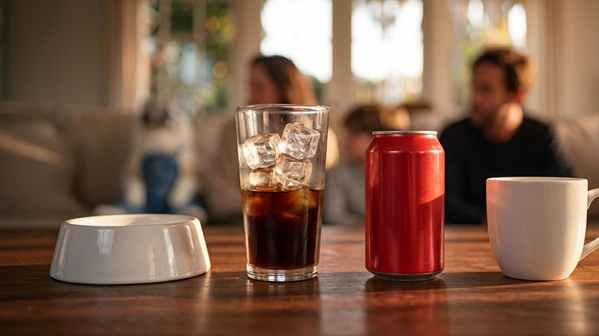

출력 결과: 음료가 따라 지기전에 보여줄 뒷부분이 블러 처리된 용기의 나열을 이전 장면 마지막 프레임으로 부터의 연속성 있는 편집으로 출력
### 편집프롬프트 2

도구:Gemini

asset_img_product_01_01.png를 편집하였습니다.


```
...
Edit the image. Zoom in tightly on the white pet bowl so it fills the lower portion of the frame. The three other drinks are no longer in the shot — only the pet bowl remains on the wooden table. The background is a smooth warm blur with no people, furniture, or other objects visible.

A bare human hand enters the frame from the right side, holding the attached can tilted downward, pouring a stream of pale green liquid into the bowl. The pale green liquid collects in the bowl. Only the hand and wrist are visible — no sleeve, no clothing, no arm beyond the wrist.

The attached can must keep its label, cat logo, "toCatter" text, and "cat together" text exactly as in the reference image — fully legible, in sharp focus, and facing the camera. The hand grips the can low on the body so it does not cover the logo or the text.

Keep the wooden table surface, the warm golden lighting, and the 16:9 aspect ratio.

```

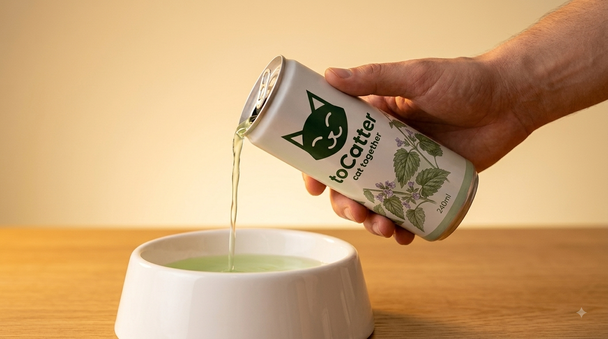

```
Edit this image only. Make these three changes:

1. Zoom in closer so the white pet bowl fills more of the frame — the bowl should be the dominant element, larger and closer to the viewer.

2. Show less of the arm. Only the fingers and the top of the hand gripping the can are visible — the wrist and forearm are outside the frame on the right edge.

3. Change the table surface to dark reddish-brown polished wood, matching a rich mahogany tone.

Keep the can's label, cat logo, "toCatter" text, and "cat together" text exactly as they are — fully legible, in sharp focus, and facing the camera. Keep the pale green liquid pouring into the bowl, the warm golden lighting, and the 16:9 aspect ratio.
```

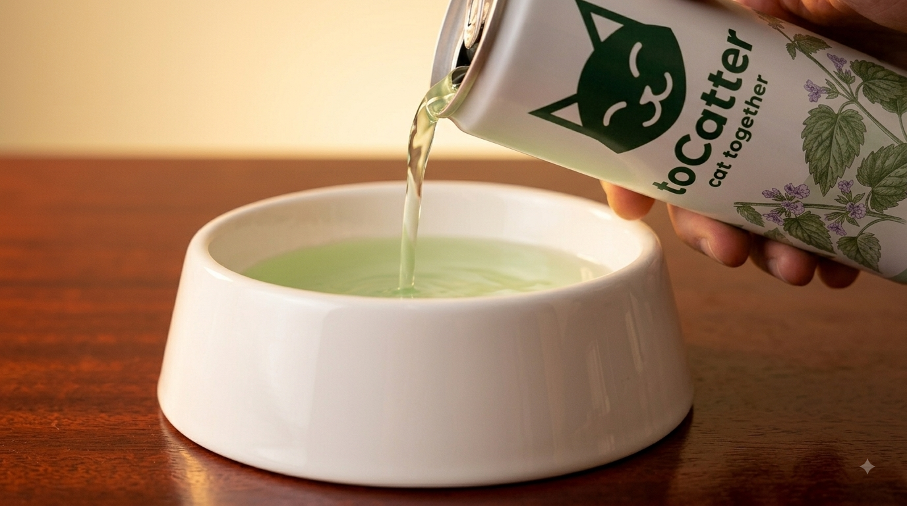

이후 claude를 통해서 로고 크롭


- **출력 결과 요약**: 음료를 따르는 장면의 마지막 프레임을 기존장면으로 부터의 연속성 있는 편집으로 출력
- **결과 파일명**: [scene_img_family_02_13](./scene_img/scene_img_family_02_13.png)

- **비디오 프롬프트**:  
### 프롬프트

도구:kling

parameter: mode: 1080p,Length 3s, Number of Outputs 1, Native Audio off

start: scene_img_family_02_11.png


end: scene_img_family_02_13.png


`liquid pours steadily from the can into the bowl, hand remains steady, cat's face enters frame from the side watching, minimal camera movement`

- **출력 결과 요약**: 음료수가 따라지는 장면 마지막에 로고 노출
- **결과 파일명**:[scene_vid_scene3_02_13](./scene_vid/scene_vid_scene3_01.mp4)

## 씬 4 (브랜드 로고)


- **길이**: 1초
- **목표 메시지**: 로고를 보여주어 브랜드 이미지를 각인하고 
- **화면 구성**: 따르던 씬에서 카메라 위로 이동 이후 로고 표시
- **나레이션**: "cat together"(캐릭터 asset_voice_02)
- **사용 도구 및 목적**: 
	-이미지: 에셋참고
	-비디오: kling(영상생성)
	-나레이션/대사: elevenlabs
	-오디오: suno(bgm)
- **결과 파일명**: 

---

## 효과음

영상 출력 이후에 출력

### 고양이 울음 소리

```
soft warm meow
```

- **출력 결과 요약**: 고양이 등장을 암시하는 귀여운 야옹소리
- **결과 파일명**: [scene_snd_cat_01.wav](./scene_snd/scene_snd_cat_01.wav)

### 빨리 돌리는 소리
```
sound that can be heard by speaker when disk scratch by dj
```

- **출력 결과 요약**: 고양이 장면에 유머를 더해줄릴을 빨리돌리는 것과 같은 소리
- **결과 파일명**: [scene_snd_disk_02.wav](./scene_snd/scene_snd_disk_02.wav)

### 캔안의 음료가 찰랑 거리는 소리
```
sound that can be heard by speaker when disk scratch by dj
```

- **출력 결과 요약**: 음료를 따르기 전 캔안의 음료가 찰랑거리는 소리
- **결과 파일명**: [scene_snd_fiz_01.wav](./scene_snd/scene_snd_fiz_01.wav)

### 음료 따르는 소리

```
sound that can be heard by speaker when disk scratch by dj
```

- **출력 결과 요약**:음료를 따를 때 나는 소리
- **결과 파일명**: [scene_snd_pour_01.wav](./scene_snd/scene_snd_pour_01.wav)


