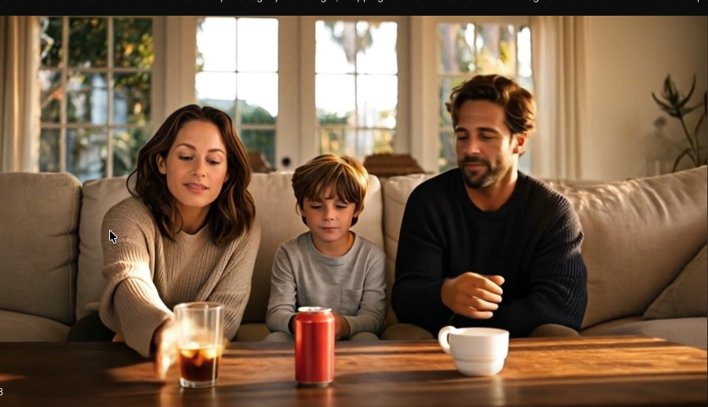
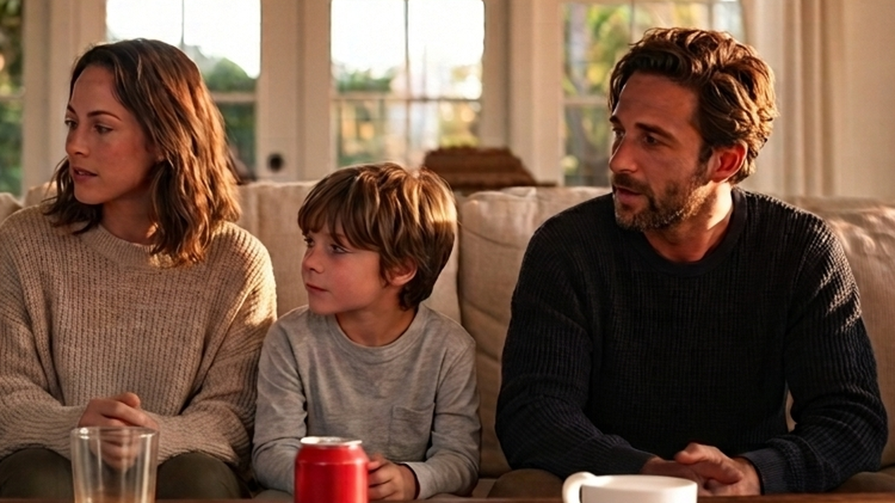
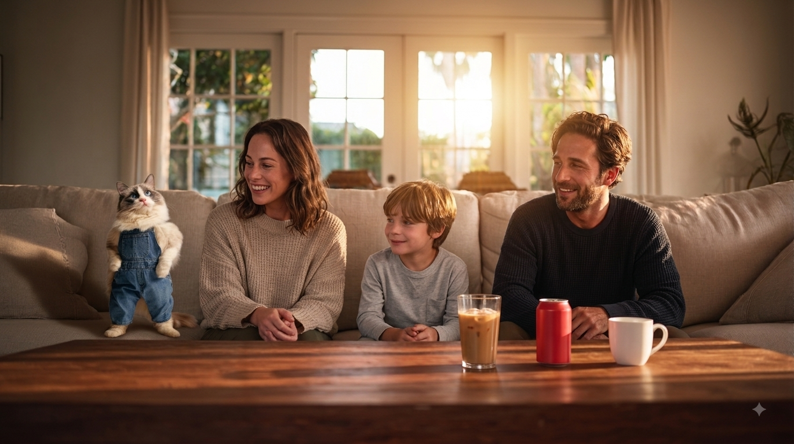
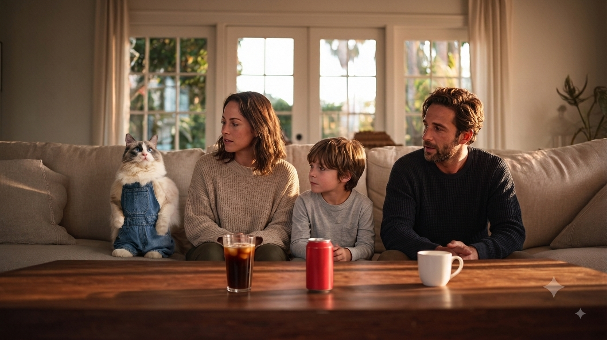
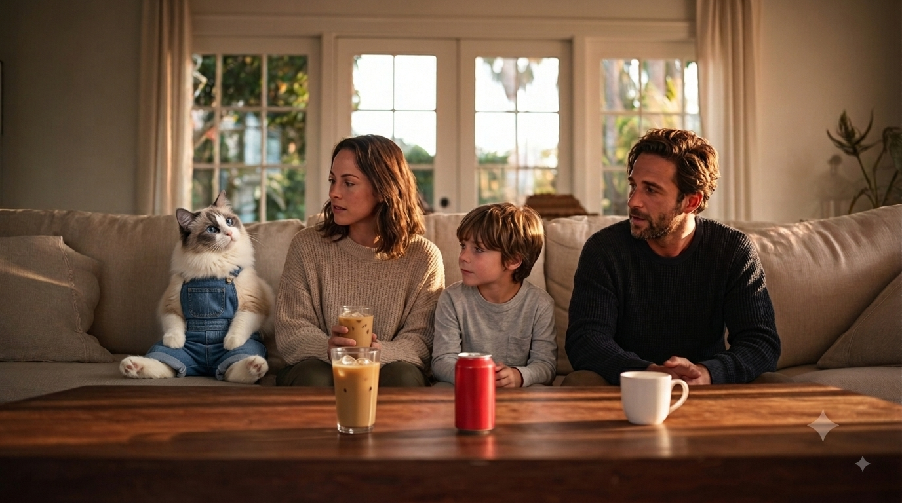
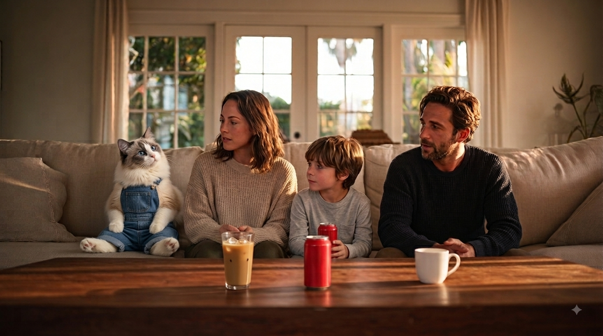
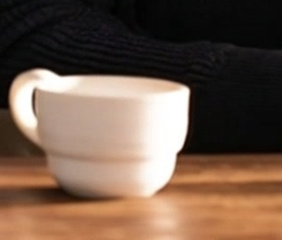
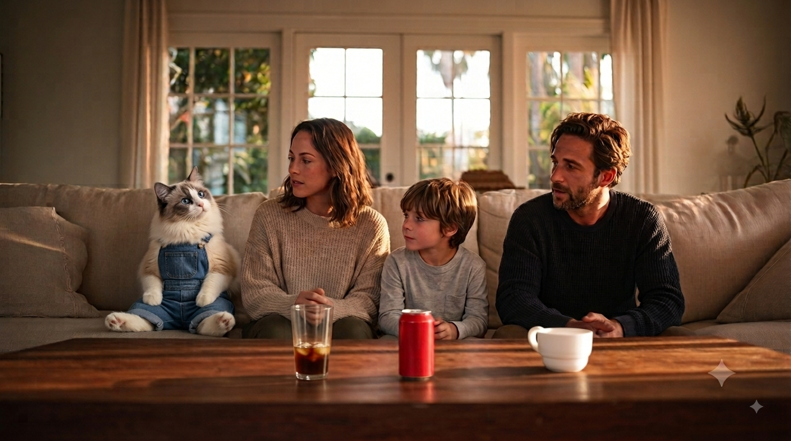
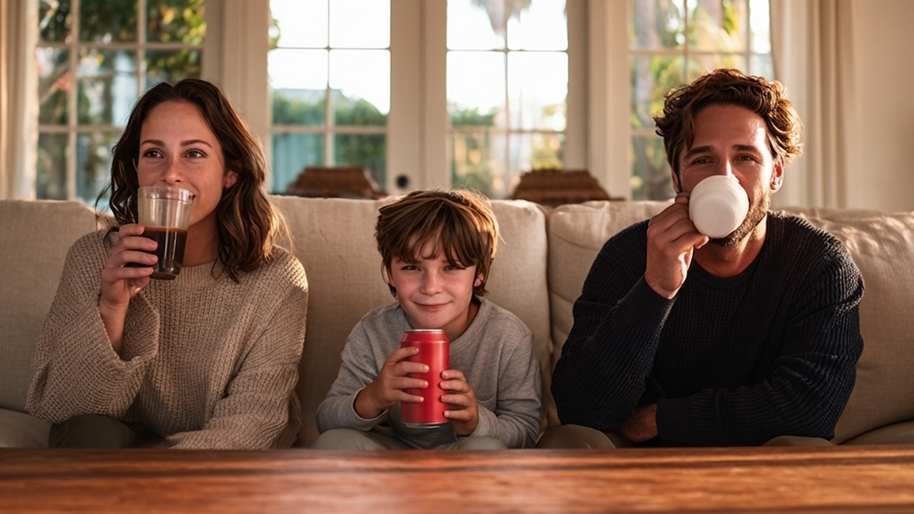

# B1-2 AI로 글, 그림, 영상 만들어 나만의 광고 만들기 — toCatter

---
## 최종 영상 파일 정보
[toCatter.mp4](./toCatter.mp4)

-파일명: toCatter.mp4

-길이: 10초

-해상도: 1920 x 1080p

-프레임레이트: 30fps

-코덱:H.264 / AAC

---
## 프롬프트 정리

- 대화형 편집은 일부 내용 생략
- 이미지와 비디오는 씬에 수록
- 효과음 프롬프트는 효과음 부분 참고
- 대사 프롬프트는 나레이션 내용 자체이며 결과파일은 나레이션에 바로 링크 - 더빙부분은 Bonus로
- 에셋을 그대로 사용한 부분들 에셋 참고
- 장면별 결과파일은 생성 프롬프트 부분으로 이동 생성프롬프트 부분의 링크는 첨부 파일로 이동
- 결과파일은 최종 생성물만 표시할 수 있다.
- 단, 편집된 마지막 파일이름은 toCatter.mp4 

---

## 편집

CapCut을 이용하였으며, 불필요한 부분 음소거, 음성과 영상파일의 절단과 이어붙이기등의 기능만 이용하였고 기존소스에 새로운 요소를 넣지 않았습니다.

---

## 결과 파일명 기준
	
	 asset or scene_종류_설명_원본시도번호_수정번호
  
  단, 프레임이나 스크린샷, 추출 파일은 임의의 이름을 사용하거나 원본시도번호,수정번호를 가지지지 않음
  ---

# 브랜드 아이덴티티

- **브랜드명**: toCatter - cat together
- **제품**: 고양이 캣닙 음료 toCatter (캔형)
- **타겟**: 반려묘를 가족 구성원으로 여기는 반료동물가구
- **톤앤매너**: 귀여움과 유머러스함
- **USP**: 많은 것을 함께 하는 반려 고양이에게 음료형 간식을 제공함으로서, 음료수를 마시며 즐거운 시간을 보내는 경험을 공유
- **목적/핵심 메시지**: "고양이도 가족이니까"

# 사용 도구 목록

| 용도 | 도구명 | 생성방식 | 선정 이유 | 대체도구 |
|------|--------|------|-----------|------|
| 기획, 음성파일 추출 | Claude | text to text | 지시 이행·추론 능력이 우수하여 아이디어 구체화와 프롬프트 반복 개선에 활용 | ChatGPT, Gemini |
| 이미지(생성) | Midjourney | text to image | 크리에이티브 업계 표준. ow 등 다양한 파라메터를 통한 일관성 유지 | Ideogram, Adobe Firefly, Leonardo AI |
| 이미지(정밀 생성·합성)1 | Gemini (mac/ios앱) | text to image (로고, 제품) | 이해 기반 편집 — 로고-제품 생성과 합성 일괄 처리에 유리 | ChatGPT(GPT Image), Ideogram |
| 이미지(편집/합성)2 | Gemini | image+text to image | 이해 기반 편집 — 로고-제품 합성, 이미지 편집 | ChatGPT, Adobe Firefly(생성형 채우기) |
| 이미지(편집/합성)3 | Claude | image+text to image | 로고 크롭 등 별도의 마커가 없어서 유리 | Photopea, GIMP |
| 영상 | Kling (웹/mac) | image to video | I2V 변환에서 temporal stability가 뛰어남 | Runway Gen-3, Luma Dream Machine, Hailuo(MiniMax) |
| 보이스 생성 | ElevenLabs | voice design | 캐릭터 보이스를 텍스트 서술로 직접 설계 가능 | Typecast, Supertone |
| 나레이션/대사1 | ElevenLabs | tts | 감정 표현력과 자연스러운 톤 | Typecast, Supertone, Google Cloud TTS |
| 나레이션/대사2 (캐릭터 대사) | Kling | image+text to video | 자체 생성 영상에 최적합한 립싱크 | HeyGen, Hedra, Runway Act-One |
| 나레이션/대사3 | ElevenLabs | voice change (audio to audio) | 원본 억양·타이밍 유지한 목소리 변환 | Respeecher, Supertone Shift |
| 효과음 | ElevenLabs | text to sound effect | 음성 분야 높은 위상, 충분한 무료크레딧 | Stable Audio, Freesound(비AI) |
| 음악 | Suno | text to music | 음악생성 AI 중 보편성 최고 | Udio, Stable Audio, Mubert |
| 영상 편집 | CapCut (무료) | 편집 | 컷 편집·오디오 믹싱·자막 통합 처리 | DaVinci Resolve, Adobe Premiere |

---


# 에셋


## 고양이


도구: 미드저니

**출력 결과 요약**: 광고의 핵심이될 귀여운 고양이
 
 **결과 파일명**: asset_img_cat_01.png

파라메터 :ar 3:4, raw, stylize 130, weird 0

### 프롬프트
```
hyperrealistic photograph of an anthropomorphic ragdoll cat standing upright on two legs, gray bicolor coat with soft gray markings on the head and ears, 
creamy white face blaze, chest, arms and paws in uniform solid cream white, long fluffy silky fur, 
striking blue eyes, pink nose, wearing blue denim overalls, alert curious expression looking at camera, natural relaxed posture with weight on one leg and one paw slightly raised,
full body, plain light gray studio background, soft warm natural lighting, shot on 85mm lens, shallow depth of field, cinematic advertising photography
 --ar 3:4 --style raw --stylize 130 --weird 0
```

- --ar 3:4 : 씬이 아니라 캐릭터 시트이므로 세로 비율을 선택했습니다. 전신 직립 자세를
  잘림 없이 담아야 이후 oref 참조 시 몸 전체의 비율 정보가 보존됩니다.
- --raw : Midjourney의 자동 미화를 억제합니다. 미화가 적용되면 털 질감이 인형처럼
  균일해져 실사 가족과 합성했을 때 이질감이 생깁니다.
- --stylize 130 : 기본값(100)보다 약간만 높여 광고용 조명감을 얻되, 프롬프트에 명시한
  털 색 배치(회색 바이컬러 + 크림색 팔)를 재해석하지 않도록 낮은 범위를 유지했습니다.
- --weird 0 : 상업 광고에서 변형은 리스크입니다. 4개 씬에서 반복 등장할 캐릭터이므로
  변형 가능성을 0으로 두었습니다.
- 배경을 plain light gray studio로 지정한 이유 : oref 소스는 캐릭터만 담겨야 이후 씬에서
  배경 요소가 함께 딸려오는 것을 막을 수 있습니다.

## 가족들


도구: 미드저니

**출력 결과 요약**: 광고에 필요한 행복하고 화목해 보이는 가족의 모습
 
 **결과 파일명**: asset_img_family_01.png

### 프롬프트

파라메터: ar 3:2  raw  stylize 120 weird 0

```
photorealistic candid family portrait, American family of three in a bright modern living room, 
father in his late 30s wearing a casual navy sweater, 
mother in her mid 30s wearing a beige cardigan, 
7 year old boy in a striped t-shirt, 
cinematic advertising photography, soft warm key light, shallow depth of field
--ar 3:2  --raw  --stylize 120 
```

- --ar 3:2 : 3인을 한 프레임에 담되 인물 얼굴이 충분히 크게 잡히는 비율입니다.
  얼굴 픽셀이 클수록 이후 oref 참조의 정확도가 올라갑니다.
- --stylize 120 : 고양이 에셋(130)과 근접한 값으로 맞춰, 두 에셋을 한 화면에 합성했을 때
  질감·조명 처리 방식이 어긋나지 않도록 했습니다.
- 3명을 개별 생성하지 않고 가족사진 1장으로 동시 확보한 이유 : 개별 생성 시
  "같은 가족처럼 보이지 않는" 문제가 생기고 참조 이미지도 3개로 늘어납니다.
  1장으로 고정하면 참조가 하나이므로 이후 모든 씬에서 동일 인물이 유지됩니다.

## 로고


도구: Gemini,Claude(크롭)

**출력 결과 요약**: 광고 최후반과 캔에 표시될 로고
 
 **결과 파일명**: asset_img_logo_01_01.png

### 프롬프트
```
Minimal flat vector logo for a cat beverage brand. 
A single stylized cat head facing forward, geometric simplified shapes, pointed triangular ears, calm friendly closed-eye expression, bold solid silhouette with negative-space eyes. 
Below the mark, brand name "toCatter" in clean rounded sans-serif, and a smaller tagline "cat together" underneath. Two-color design: deep forest green mark on warm cream background. 
Centered, sharp edges, high contrast, no gradients, no photorealism, no extra text.
```

이후 

claude로 제미나이 마크 크롭

## 제품

도구: Gemini

**출력 결과 요약**: 로고가 잘 인쇄된 캔
 
 **결과 파일명**: asset_img_product_01_01.png


### 프롬프트

```
Photorealistic product shot of a slim 240ml aluminum beverage can, Korean botanical drink packaging style. 
Clean white and brushed silver base with a soft green accent band near the bottom. 
Detailed illustration of catnip leaves and small pale purple catnip flowers wrapping around the lower half. 
Vertical typography reading "toCatter" on the upper portion. Minimal retro herbal-beverage aesthetic. 
Clean white studio background, soft diffused lighting, subtle condensation droplets, centered composition, commercial product photography.
```

### 편집 프롬프트

```
로고와 제품은 같은 세션에서 생성 되었습니다.
... 
Apply the attached logo onto the upper label area of this can. Keep the can's shape, lighting, reflections, and botanical illustration unchanged. 
The logo should follow the curvature of the can surface naturally and stay fully legible.
```

출력 결과: 로고가 잘 인쇄된 캔

## 나레이션 보이스 - 중년 남성 목소리

도구:elevelabs

**출력 결과 요약**: 출력 결과:나레이션을 담당할 중년 성우 목소리

 **결과**: asset_voice_01(파일이 아닌 툴에서 사용 가능한 에셋)

### 프롬프트
```
Native korean. Male, 35–40,Broadcast quality(tv advertisement)
Persona:narrator for humanistic documentary . Emotion:encouraging,smooth ,little low, middle-aged
this is voice for advertise environmentally friendly product
```

## 캐릭터 보이스 - 고양이 목소리

도구:elevelabs

**출력 결과 요약**: 고양이 립싱크에 쓰일 귀여운 캐릭터 목소리
 
 **결과**: asset_voice_02(파일이 아닌 툴에서 사용 가능한 에셋)
 
### 프롬프트

```
An animated cartoon character voice for a family advertisement, high-pitched and light with a soft airy quality, slightly nasal, 
playful and expressive, curious and a little plaintive, gentle and small in scale, warm cartoon timbre with a soft whine at the end of phrases
```

## bgm

**출력 결과 요약**: 출력 결과 요약:광고에 어울리는 경쾌한 컨트리풍의 음악 약 10초분량
**결과 파일명**: [asset_bgm_01.mp3](./asset_bgm/asset_bgm_01.mp3)

도구:suno

**styles(프롬프트)**

```
upbeat country advertising jingle, 100 BPM, acoustic guitar strumming, banjo, light hand claps, tambourine, warm and cheerful, simple repeating 4-bar phrase, clean loop, bright major key, no vocals, commercial background music

[Intro - 4 bars]
[Main Loop - 4 bars]
[Main Loop repeat - 4 bars]
[Main Loop repeat - 4 bars]
[Outro - 2 bars]
```

---

# 스토리보드 (총 10초 / 4컷)

## 목적
고양이용 음료를 함께하는 시간을 공유함으로서 가족으로 더 가깝게 느낄수 있는 가치를 전달한다.

## 씬 1 (일상 — 가족들이 함께 음료를 마신다)


- **길이**: 4초
- **목표 메시지**: 음료를 함께하는 가족의 모습을 통해 음료가 가정에서 가지는 공유의 가치를 부각한다.
- **화면 구성**: 소파에 함께 앉은, 아빠·엄마·아들이 각자 다른 음료를 마심. 세 명이 한 프레임에 자연스럽게 배치.
- **나레이션**: ["가족들이 모이면 모두 좋아하는 음료수를 함께 즐기죠 - 중년 남성 asset_voice_01"](./scene_nar/scene_nar_family_01.wav)
- **효과음**: 없음
- **사용 도구 및 목적**: 
	-이미지: 미드 저니(시작 이미지 생성), 제미나이(아이의 캔의 로고 제거)
	-비디오: kling
	-나레이션/대사: elevenlabs
	-오디오:suno(bgm)
  **결과 파일명**: [scene_vid_scene1_01.mp4](./story_board.md#프롬프트1)/[scene_vid_scene1Link_01.mp4](./story_board.md#프롬프트2)/[scene_img_family_02_01.png](./story_board.md#수정프롬프트)/[asset_bgm_01.mp3](./story_board.md#bgm)/[scene_nar_family_01.wav](./story_board.md#씬-1-일상--가족들이-함께-음료를-마신다)
### 이미지 프롬프트

#### 프롬프트

도구:미드저니

asset_img_family_01.png를 기반으로 아래 프롬프트 입력 캐릭터 일관성을 위해 ow에 100을 넣고 시험해 보았습니다.


파라메터: ar 16:9  raw  stylize 120  weird 0 ow 100

```
photorealistic candid living room scene, American family of three relaxing on a beige sofa, low wooden coffee table in front of them, 
mother on the left lifting a tall clear glass of iced coffee to her lips mid-sip, 
father on the right drinking from a white ceramic mug, 
young boy in the middle tilting a red soda can up to drink, 
all three looking away from the camera in different directions, unposed natural moment, 
medium shot filling the frame, warm golden afternoon light through the window, 
cinematic advertising photography, shot on 50mm lens 
--ar 16:9  --raw  --ow 100  --stylize 120 
```


- --ar 16:9 : 이 시점부터는 캐릭터 시트가 아니라 영상에 들어갈 씬이므로,
  최종 출력 비율과 일치시켜 후속 크롭에서 화질 손실이 생기지 않게 했습니다.
- --ow 100 : Omni Reference 강도. 초기값으로 중간 수준을 선택했습니다.
  참조를 지나치게 강하게 걸면 원본 사진의 포즈(정면 응시 기념사진 구도)까지
  따라오기 때문에, 얼굴만 가져오고 동작은 프롬프트로 새로 지시하려는 의도였습니다.
- 이전 시도에서 --sref(Style Reference)를 사용했으나, sref는 색감·조명뿐 아니라
  구도까지 전이시켜 인물이 카메라를 보고 웃는 기념사진 구도가 재현되었습니다.
  인물 동일성은 sref가 아니라 oref의 역할이므로 파라미터를 교체했습니다.

- **이미지 출력 결과 요약**:구도등은 원하는 이미지에 근사하나  일관성이 조금 부족한 이미지, 테이블위가 난잡하여 영상 일관성에 지장
- **이미지 결과 파일명**:[scene_img_family_01.png](./scene_img/scene_img_family_01.png)


아동 캐릭터와의 유사성이 떨어고 테이블위에 다른 사물이 있어서 프롬프트를 수정하고 유사성과 관련된 파라미터인 ow를 표준적인 범위 안에서 상향 하였습니다.

#### 수정프롬프트

파라메터: ar 16:9  raw  stylize 120 weird 0 ow 400

```
photorealistic candid living room scene, American family of three relaxing on a long beige sectional sofa that extends to the right side of the frame, 
low wooden coffee table running parallel along the full width of the frame, completely bare polished tabletop with nothing placed on it, 
empty sofa seat and empty table space to the right of the father, 
mother on the left lifting a tall clear glass of iced coffee to her lips mid-sip, 
young boy with shaggy brown hair and freckles in the middle tilting a red soda can up to his mouth drinking, 
father on the right drinking from a white ceramic mug, 
each person holding exactly one drink and nothing else, 
all three looking away from the camera in different directions, unposed natural moment, 
wide medium shot, warm golden afternoon light through the window, 
cinematic advertising photography, shot on 50mm lens
 --ar 16:9  --raw  --ow 400  --stylize 120 
``` 


- --ow 100 → 400 : 아동 캐릭터의 얼굴 유사도가 가장 낮게 나오는 문제가 반복되어
  참조 강도를 상향했습니다. 성인 얼굴은 100에서도 유지되었으나 아동은 특징점이
  적어 낮은 강도에서 다른 인물로 생성되는 경향이 있었습니다.
- 400을 선택한 이유 : ow는 값이 높을수록 참조 이미지의 포즈까지 끌고 오는 부작용이
  있으므로, 프롬프트에 "mid-sip", "looking away from the camera in different directions",
  "unposed natural moment"를 명시해 동작을 별도로 고정한 뒤 강도를 올렸습니다.
  즉 파라미터 상향과 프롬프트 보강을 동시에 적용해 부작용을 상쇄했습니다.
- 프롬프트 측 수정 : 테이블 정리를 --no(부정 지시) 대신
  "completely bare polished tabletop with nothing placed on it"이라는 긍정 상태 서술로
  처리했습니다. Midjourney에서 --no는 위치 조건("테이블 위")을 해석하지 못하고
  화면 전체에서 해당 요소를 제거하려 하기 때문에, 인물이 든 음료까지 영향을 받습니다.
- 프롬프트 측 수정 : "empty sofa seat and empty table space to the right of the father"로
  빈 공간을 명시했습니다. 이는 다음 씬에서 고양이가 등장할 자리를 미리 확보하기 위한
  구도 설계입니다.

- **이미지 출력 결과 요약**:구도등은 원하는 이미지에 근사하나  일관성이 조금 부족한 이미지, 테이블위가 난잡하여 영상 일관성에 지장
- **이미지 결과 파일명**:[scene_img_family_02](./scene_img/scene_img_family_02.png)

이후 위의 이미지 제미나이를 통해 아동이 가진 캔의 로고를 제거


- **이미지 출력 결과 요약**:영상제작에 쓰일 수 있는 가족이 음료를 공유하는 장면 로고도 제거
- **이미지 결과 파일명**:[scene_img_family_02_01.png](./scene_img/scene_img_family_02_01.png)

 **비디오 프롬프트**

#### 프롬프트1

도구:kling

parameter: mode: 1080p,Length 3s, Number of Outputs 1, Native Audio off

start: scene_img_family_02_01.png


end: 없음

```
The family lower their drinks onto the table. 
The camera pans slightly to the right, cropping the mother's left arm at the edge of the frame. 
Then the camera pans back to the left and gradually widens, revealing an anthropomorphic ragdoll cat in denim overalls sitting on the sofa beside the mother.
 Smooth continuous camera movement, warm golden afternoon light.
```

- mode 1080p : 전 클립을 동일 해상도로 통일했습니다. 소스 이미지들은 생성·편집 과정에서
  해상도가 제각각이었으나, Kling 출력 단계에서 1080p로 재렌더링되므로
  이 지점이 해상도 통일의 기준점이 됩니다.
- Length 3s : 10초 4컷 구조에서 컷당 실사용 길이에 맞춰 최소 길이를 선택했습니다.
  생성 길이가 길어질수록 Kling이 남는 시간을 채우기 위해 지시하지 않은 움직임을
  만들어내며, 이때 컵·캔 같은 정지 사물이 변형되는 현상이 발생했습니다.
- Number of Outputs 1 : 크레딧 절약. 이미지 단계에서 구도를 확정했기 때문에
  복수 출력 중 선택할 필요가 낮았습니다.
- Native Audio off : 오디오 생성은 크레딧 소모가 크고, 나레이션·효과음·BGM은
  각각 전용 도구(ElevenLabs, Suno)로 제작하므로 불필요합니다.
  단, 립싱크가 필요한 씬 2의 대사 클립에서만 on으로 전환했습니다.
- start frame만 지정하고 end frame을 비운 경우 : 시작·끝 프레임의 출처가 다르면
  두 프레임 사이의 사물 배치 차이를 Kling이 보간하면서 없던 유리잔이 생성되거나
  컵이 이동하는 아티팩트가 발생합니다. 목표 프레임이 없으면 보간 대상이 사라지므로
  사물이 고정됩니다.
- start/end를 모두 지정한 경우 : 다음 컷과의 연결이 필요한 구간에서만 사용했으며,
  이때는 두 프레임을 반드시 동일한 원본에서 파생시켜 사물 배치를 일치시켰습니다.
  
- **출력 결과 요약**:  가족들이 음료수를 마시는 장면부터 시작하여 내려놓는 장면이 담김
- **결과 파일명**:[scene_vid_scene1_01.mp4](./scene_vid/scene_vid_scene1_01.mp4)

#### 프롬프트2

도구:kling

parameter: mode: 1080p,Length 3s, Number of Outputs 1, Native Audio off

start: scene_frame_putDown.png


end: start: scene_img_family_02_14.png
다음 장면 시작프레임이면서, scene_img_family_02_08을 Claude를 사용하여 가족만 나오게 잘라낸 scene_img_family_02_14.png를 이용하였습니다.



```
Only the camera moves, slowly and smoothly. Everyone stays seated and still. 
The glass, the red can, and the white mug stay exactly where they are on the table. Warm golden afternoon light.
```

- **출력 결과 요약**:  내려놓는 장면을 다음씬의 시작 부분과 맞게 변경
- **결과 파일명**:[scene_vid_scene1Link_01.mp4](./scene_vid/scene_vid_scene1Link_01.mp4)


## 씬 2 (문제 — 고양이 등장 나는? )


- **길이**: 2초
- **목표 메시지**: 문제 제시 고양이도 음료수를 공유할 수 없을지 생각하게 한다.
- **화면 구성**: 팬아웃 되면서 고양이 들어남 고양이 클로즈업
- **나레이션/대사**: "나는? -캐릭터 asset_voice_02"-[Bonus 참고](./story_board.md#bonus)
- **효과음**: 고양이 울음소리(scene_snd_cat_01.wav),빨리 돌리는 소리(scene_snd_disk_02.wav)
- **사용 도구 및 목적**: 
	-이미지: Gemini(기존 이미지에 고양이가 등장하게 편집),Claude( 제미나이 마크 제거,동영상 생성용 클로즈업)
	-비디오: kling
	-나레이션/대사: kling(자체 더빙),claude(영상에서 자체더빙 음원 추출),elevenlabs(자체더빙 음원으로부터 보이스 캐릭터 보이스로 교체)
	-오디오:elevenlabs(효과음)
- **출력(편집) 결과 요약**: 고양이 소리와 함께 화면이 팬아웃 되면서 가족들과 함께 하지 못했던 고양이가 들어나고 고양이가 클로즈업 되면서 대사를 전달
- **결과 파일명**: [scene_vid_scene2enterCat_02.mp4](./story_board.md#수정프롬프트-1)/[scene_vid_scene2closeUp_01.mp4](./story_board.md#프롬프트2-1)/[scene_img_family_02_08.png](./story_board.md#편집프롬프트-1)/[scene_nar_mine_01.wav](./story_board.md#더빙)/[scene_snd_cat_01.wav](./story_board.md#고양이-울음-소리)/[scene_snd_disk_02.wav](./story_board.md#빨리-돌리는-소리)

## 이미지 프롬프트

#### 편집프롬프트 1

도구:Gemini

scene_img_family_02_01.png에 asset_img_cat_01를 첨부하여 편집하였습니다.


```
....

Create a new scene from this living room image that you just made. 
The three drinks — the tall glass of iced coffee, the white ceramic mug, and the plain red soda can — are now placed on the wooden coffee table in a row.
 The family members have set their drinks down. 
 Add the cat that I gave you sitting upright on the sofa to the left of the mother, head tilted to one side with a questioning expression, looking toward the family on its right. 
 There is empty table space in front of the cat with nothing on it. 
 Keep the cat's fur pattern, denim overalls, and proportions exactly as in the reference image. 
 Match the warm golden afternoon lighting and add a soft shadow.
```



```
Do it again I will give you all the sources. Cat is too small and have to sit next to family. And color of the woman’s drink has changed match it to the original.
Now read the dirction carefully
Create a new scene from this living room image that you just made. The three drinks — the tall glass of iced coffee, the white ceramic mug, and the plain red soda can — are now placed on the wooden coffee table in a row. 
The family members have set their drinks down. 
Add the cat that I gave you sitting upright on the sofa to the left of the mother, head tilted to one side with a questioning expression, looking toward the family on its right. 
There is empty table space in front of the cat with nothing on it. 
Keep the cat's fur pattern, denim overalls, and proportions exactly as in the reference image. 
Match the warm golden afternoon lighting and add a soft shadow.
```


```
Do it again I will give you all the sources. Cat is too small and have to sit next to family. And color of the woman’s drink has changed match it to the original.
Now read the dirction carefully
Create a new scene from this living room image that you just made. 
The three drinks — the tall glass of iced coffee, the white ceramic mug, and the plain red soda can — are now placed on the wooden coffee table in a row. 
The family members have set their drinks down. 
Add the cat that I gave you sitting upright on the sofa to the left of the mother, head tilted to one side with a questioning expression, looking toward the family on its right. 
There is empty table space in front of the cat with nothing on it. Keep the cat's fur pattern, denim overalls, and proportions exactly as in the reference image. 
Match the warm golden afternoon lighting and add a soft shadow.
```


```
Refine this image with these corrections. Keep the original 16:9 widescreen aspect ratio and the exact same framing and camera position.

1. The cat must sit exactly the way the boy sits: back against the sofa backrest, bottom on the cushion, both legs extended forward along the seat, front paws resting on its thighs, chest facing the camera. It sits like a person, not like an animal.

2. Make the cat slightly larger, so its head reaches the same height as the mother's shoulder.

3. The cat's head is tilted to one side with a questioning expression, looking to its right toward the family.

4. The mother's glass contains light caramel-brown iced coffee with visible ice cubes.

5. Keep everything else unchanged — the family's poses and faces, the sofa, the table, the mug, the red can, and the lighting.
```


```
Edit this image only. Make these three changes:

1. The mother's hands are empty and rest on her lap. She is not holding anything. There is exactly one tall glass in this scene and it stands on the wooden table.

2. Change the liquid in that glass to dark brown, the color of black iced coffee with only a small amount of milk. It should look much darker than it currently does.

3. Reduce the liquid level so the glass is about half full, as if someone has already been drinking from it. Keep the ice cubes visible.

Keep everything else in the image exactly as it is — the cat's pose and size, the family's faces and poses, the sofa, the table, the mug, the red can, and the lighting. Do not change the composition or the aspect ratio.
```


이후 씬 1의 scene_vid_scene1_01.mp4 프레임중 하나를 스크린샷으로 촬영하여 통해서 컵의 방향을 수정하도록 첨부



```
Edit this image only. Make these two changes:

1. Rotate the white ceramic mug so its handle points same direction like the attached mug’s handle

2. The tall glass contains dark brown iced coffee filled to about one-third of the glass, noticeably less than now, as if most of it has been drunk. Keep the ice cubes visible.

Keep everything else exactly as it is — the cat's pose and size, the family's poses and faces, the sofa, the table, the red can, and the lighting.
```



이후 claude로 제미나이 로고 크롭
 


- **이미지 출력 결과 요약**: 고양이가 등장하는 씬으로 연결되기 위한 이미지 확보 음료의 배열등 이후에 자연스럽게 이어지게 하기 위해서 추가수정
- **이미지 결과 파일명**: [scene_img_family_02_08.png](./scene_img/scene_img_family_02_08.png)

### 비디오 프롬프트

#### 프롬프트1

도구:kling

parameter: mode: 1080p,Length 5s, Number of Outputs 1, Native Audio off

start: scene_img_family_02_15.png
scene_img_family_02_01.png을 Claude를 사용하여제미나이 마크를 제거한 scene_img_family_02_15.png를 이용하였습니다.



end: scene_img_family_02_08.png를 사용하였습니다.


```
The family lower their drinks onto the table.
 The camera pans slightly to the right, cropping the mother's left arm at the edge of the frame. 
 Then the camera pans back to the left and gradually widens, revealing an anthropomorphic ragdoll cat in denim overalls sitting on the sofa beside the mother.
```

- **비디오 출력 결과 요약**:지나치게 분량을 한번에 생성하여 컵을 내려놓는 연결이 자연스럽지만 고양이가 갑자기 나타나면서 기대했던 영상을 얻지못함.
- **비디오 결과 파일명**:[scene_vid_scene2enterCat_01.mp4](./scene_vid/scene_vid_scene2enterCat_01.mp4)

#### 수정프롬프트 1

씬2를 위해서 씬1에 컵위치를 바꾸는 연결영상을 추가하고, 시작점을 바꾼다음에 카메라 움직임과 고양이 등장에 대한 지시를 추가함

도구:kling

parameter: mode: 1080p,Length 3s, Number of Outputs 1, Native Audio off

start: scene_img_family_02_14.png
scene_img_family_02_08을 Claude를 사용하여 가족만 나오게 잘라낸 scene_img_family_02_14.png를 이용하였습니다.


end: scene_img_family_02_08.png을 사용하였습니다.


```
Only the camera moves. The frame gradually widens and more of the sofa on the left comes into view, bringing an anthropomorphic ragdoll cat in denim overalls into the shot.
 The cat is already sitting on the sofa beside the mother from the very first frame and stays completely still in the same spot the whole time. 
 The family stay seated and still. 
 The glass, the red can, and the white mug remain in their exact positions on the table. 
 Everything in the scene is motionless and only the framing changes. 
 Warm golden afternoon light.
```

- **비디오 출력 결과 요약**:줌아웃 하면서 자연스럽게 가족들과 함께 하지 못했던 고양이가 드러남
- **비디오 결과 파일명**:[scene_vid_scene2enterCat_02.mp4](./scene_vid/scene_vid_scene2enterCat_02.mp4)

#### 프롬프트2

도구:kling

parameter: mode: 1080p,Length 3s, Number of Outputs 1, Native Audio on

start: scene_img_family_02_08.png)


end: 


```
The camera moves in smoothly toward the cat.
The cat tilts its head to one side with a questioning expression and says, "나는?" 
The family stay seated and still. 
The glass, the red can, and the white mug stay exactly where they are on the table. 
Warm golden afternoon light.
```

- Native Audio on : 이 클립에서만 활성화했습니다. 립싱크는 오디오 생성이 있어야
  입 모양이 대사에 동기화되므로, 보너스 과제(립싱크) 달성을 위한 필수 설정입니다.
- 대사를 따옴표로 감싼 이유 : Kling은 따옴표 안의 문자열을 발화 내용으로 해석합니다.
  따옴표 없이 서술하면 대사가 아니라 장면 묘사로 처리됩니다.
- 생성된 음성을 그대로 쓰지 않은 이유 : 립싱크 타이밍은 정확했으나 음색이
  캐릭터에 맞지 않았습니다. 그러나 음성을 새로 만들면 입 모양과 어긋나므로,
  타이밍은 보존하고 음색만 교체하는 Voice Change(STS)를 선택했습니다.

- **비디오 출력 결과 요약**:고양이 목소리가 자체 더빙되어 이후 교체할 수 있는 고양이가 클로즈업 되면서 말하는 장면
- **비디오 결과 파일명**:[scene_vid_scene2closeUp_01.mp4](./scene_vid/scene_vid_scene2closeUp_01.mp4)

## 씬 3 (전환 ・ 해결/제안 — 따라준다)


- **길이**: 3초
- **목표 메시지**: 나레이션으로 제품명과 핵심메시지를 전달하면서 식탁위에 고양이의 물그릇과 음료를 참여 시킴으로서 문제를 해결하고 가족의 일원으로서 공유한다는 가치를 보여준다.
- **화면 구성**: 장면전환 클로즈업 된 식탁위의 음료수용기들 고양이를 우한 물그릇이 같이 있음. 사람 손이 toCatter 캔을 기울여 고양이 물그릇에 따름. 프레임 안에 손·캔·그릇만 (캔 라벨이 정면으로 읽혀야 함). 로고색으로 화면 천천히 전환 핵심메시지 나레이션 전달.
- **나레이션/대사**: "[고양이도 가족이니까 -중년 남성 asset_voice_01](./scene_nar/scene_nar_catFamily_01.wav).","[투 캐터 - 중년 남성 asset_voice_01](./scene_nar/scene_nar_tocatter_01.wav)"
- **효과음**:bgm(asset_bgm_01.mp3) 다시 시작, 음료 찰랑 거리는 소리(scene_snd_fiz_01.wav), 음료 따르는 소리(scene_snd_pour_01.wav)
- **사용 도구 및 목적**: 
	-이미지: 제미나이(이미지 편집을 통해서 시작프레임,마지막 프레임 생성)
	-비디오: kling(영상생성)
	-나레이션/대사: elevenlabs
	-오디오: suno(bgm),elevenlabs(효과음)
- **출력(편집) 결과 요약**: 음료수가 등장하면서 따라지고 브랜드 로고가 제품과 함께 들어나며 나레이션으로 핵심메시지와 제품명이 전달됨
- **결과 파일명**: [scene_vid_scene3_01.mp4.](./story_board.md#프롬프트-7)/[scene_img_fmaily_02_10.png](./story_board.md#편집프롬프트-1-1)/[scene_img_family_02_13.png](./story_board.md#편집프롬프트-2)/[scene_nar_catFamily_01.wav](./story_board.md#씬-3-전환--해결제안--따라준다)/[scene_nar_tocatter_01.wav](./story_board.md#씬-3-전환--해결제안--따라준다)/[asset_bgm_01.mp3](./story_board.md#bgm)/[scene_snd_fiz_01.wav](./story_board.md#캔안의-음료가-찰랑-거리는-소리)/[scene_snd_pour_01.wav](./story_board.md#음료-따르는-소리)

### 이미지 프롬프트

#### 편집프롬프트 1

도구:Gemini

scene_img_family_02_06.png 를 편집하였습니다.


```
....

Edit this image only. Zoom in on the wooden coffee table so it fills the frame, showing the three drinks from a close, low angle. 
The family and the cat are visible only as a soft blur in the background.
The tall glass contains dark brown iced coffee, the color of black coffee with only a small amount of milk, filled to about half the glass with ice cubes visible above the liquid line. 
Keep this exact color and level — do not make it lighter or fuller.
The red can and the white ceramic mug stay exactly as they are.
Add a white ceramic pet bowl on the table to the left of the three drinks, so all four containers are lined up in a row. 
Keep the warm golden lighting and the 16:9 aspect ratio.
```


이후 claude로 제미나이 로고 크롭
 


- **이미지 출력 결과 요약**: 음료가 따라 지기전에 보여줄 뒷부분이 블러 처리된 용기의 나열을 이전 장면 마지막 프레임으로 부터의 연속성 있는 편집으로 출력
- **이미지 결과 파일명**: [scene_img_family_02_10.png](./scene_img/scene_img_family_02_10.png)
 
#### 편집프롬프트 2

도구:Gemini

asset_img_product_01_01.png를 편집하였습니다.


```
...
Edit the image. Zoom in tightly on the white pet bowl so it fills the lower portion of the frame. 
The three other drinks are no longer in the shot — only the pet bowl remains on the wooden table. 
The background is a smooth warm blur with no people, furniture, or other objects visible.

A bare human hand enters the frame from the right side, holding the attached can tilted downward, pouring a stream of pale green liquid into the bowl. 
The pale green liquid collects in the bowl. Only the hand and wrist are visible — no sleeve, no clothing, no arm beyond the wrist.

The attached can must keep its label, cat logo, "toCatter" text, and "cat together" text exactly as in the reference image — fully legible, in sharp focus, and facing the camera. 
The hand grips the can low on the body so it does not cover the logo or the text.

Keep the wooden table surface, the warm golden lighting, and the 16:9 aspect ratio.

```


```
Edit this image only. Make these three changes:

1. Zoom in closer so the white pet bowl fills more of the frame — the bowl should be the dominant element, larger and closer to the viewer.

2. Show less of the arm. Only the fingers and the top of the hand gripping the can are visible — the wrist and forearm are outside the frame on the right edge.

3. Change the table surface to dark reddish-brown polished wood, matching a rich mahogany tone.

Keep the can's label, cat logo, "toCatter" text, and "cat together" text exactly as they are — fully legible, in sharp focus, and facing the camera. 
Keep the pale green liquid pouring into the bowl, the warm golden lighting, and the 16:9 aspect ratio.
```


이후 claude를 통해서 로고 크롭


- **이미지 출력 결과 요약**:  음료를 따르는 장면의 마지막 프레임을 기존장면으로 부터의 연속성 있는 편집으로 출력
- **이미지 결과 파일명**: [scene_img_family_02_13.png](./scene_img/scene_img_family_02_13.png)

### 비디오 프롬프트

#### 프롬프트

도구:kling

parameter: mode: 1080p,Length 3s, Number of Outputs 1, Native Audio off

start: scene_img_family_02_10.png


end: scene_img_family_02_13.png


```
The camera moves in smoothly toward the white pet bowl. 
A hand holding a slim can enters the frame from the upper right corner, already fully outside the frame before it appears, and moves diagonally down toward the bowl. 
The can is complete with its printed label from the very first moment it becomes visible at the frame edge. 
It tilts over the bowl and pours a stream of pale green liquid. Warm golden light.
```

- **비디오 출력 결과 요약**: 음료수가 따라지는 장면 마지막에 제품(캔) 위에 로고 노출
- **비디오 결과 파일명**: [scene_vid_scene3_01.mp4](./scene_vid/scene_vid_scene3_01.mp4)

## 씬 4 (브랜드 로고)


- **길이**: 1초
- **목표 메시지**: 브랜드로고카드를 통해 브랜드(제품)명과 메이커를 최종적으로 각인시키면서 메이커이름도 나래이션으로 부각한다.
- **화면 구성**: 따르던 씬 마지막프레임에서 카메라 위로 이동 이후 로고 표시
- **나레이션**: ["cat together-캐릭터 asset_voice_02"](./scene_nar/scene_nar_cattogether_01.wav)
- **사용 도구 및 목적**: 
	-이미지: Gemini(로고 이미지 생성),Claude(크롭) - [에셋-로고](./story_board.md#로고) 참고
	-비디오: kling
	-나레이션/대사: elevenlabs
	-오디오: suno(bgm)
- **출력(편집) 결과 요약**: 이전 장면의 마지막 프레임에서 자연스러운 카메라 움직임으로 브랜드 로고가 출력되고 메이커 이름이  캐릭터 보이스로 전달됨
- **결과 파일명**: [scene_vid_scene4_01.mp4](./story_board.md#프롬프트-8)/[asset_img_logo_01.png](./story_board.md#로고)/[asset_bgm_01.mp3](./story_board.md#bgm)/[scene_nar_cattogether_01.wav](./story_board.md#씬-4-브랜드-로고)
- **이미지 프롬프트**: [에셋-로고](./story_board.md#로고) 참고

#### 비디오 프롬프트  

#### 프롬프트

도구:kling

parameter: mode: 1080p,Length 3s, Number of Outputs 1, Native Audio off

start: scene_img_family_02_13.png(이전 장면의 마지막 프레임을 사용)


end: asset_img_logo_01_01.png(마지막 로고 화면을 사용)


```
The camera tilts smoothly upward, away from the bowl and toward the plain cream-colored wall above. 
The logo is already printed on the wall from the very first moment it becomes visible at the frame edge, complete and sharp.
 Only the camera moves.
 Warm golden light.
```

- **비디오 출력 결과 요약**: 음료수가 따라지는 장면에서 자연스럽게 카메라가 올라가면서 마지막에 로고 노출
- **비디오 결과 파일명**:[scene_vid_scene4_01.mp4](./scene_vid/scene_vid_scene4_01.mp4)

---

## 효과음

영상 출력 이후에 출력

### 고양이 울음 소리

```
soft warm meow
```

- **출력 결과 요약**: 고양이 등장을 암시하는 귀여운 야옹소리
- **결과 파일명**: [scene_snd_cat_01.wav](./scene_snd/scene_snd_cat_01.wav)

### 빨리 돌리는 소리
```
sound that can be heard by speaker when disk scratch by dj
```

- **출력 결과 요약**: 고양이 장면에 유머를 더해줄릴을 빨리돌리는 것과 같은 소리
- **결과 파일명**: [scene_snd_disk_02.wav](./scene_snd/scene_snd_disk_02.wav)

### 캔안의 음료가 찰랑 거리는 소리
```
Gentle fizzing and sloshing of liquid inside a metal can.
```

- **출력 결과 요약**: 음료를 따르기 전 캔안의 음료가 찰랑거리는 소리
- **결과 파일명**: [scene_snd_fiz_01.wav](./scene_snd/scene_snd_fiz_01.wav)

### 음료 따르는 소리

```
liquid pouring steadily into a ceramic bowl
```

- **출력 결과 요약**:음료를 따를 때 나는 소리
- **결과 파일명**: [scene_snd_pour_01.wav](./scene_snd/scene_snd_pour_01.wav)

# Bonus

## 더빙

자연스러운 더빙을 위해서 원본 장면2의 대사부부을 생성 할 때 [scene_vid_scene2closeUp_01.mp4](./story_board.md#프롬프트2-1)
native audio를 on으로 하여 생성하고

```
 ...
 The cat tilts its head to one side with a questioning expression and says, "나는?" 
 ...
```

Claude를 사용하여 해당 대사가 있는 음성 파일을 추출하였습니다.
[naneun_original.wav](./scene_extract/naneun_original.wav)

이후 보이스 체인지를 할 수 있게 길이를 5초이상으로 요구하였기 떄문에 
Claude를 이용하여 2초 짜리 음성을 7초로 늘리고

 [naneun_looped_7s.wav](./scene_extract/naneun_looped_7s.wav)

위 파일을 입력값으로 사용하고
아래와 같은 설정으로 변화하여
이후 편집 과정에서 잘라내어 삽입하였습니다.

---
**입력**: [naneun_looped_7s.wav](./scene_extract/naneun_looped_7s.wav)

**설정**:

[asset_voice_02](./story_board.md#캐릭터-보이스---고양이-목소리)

음성 asset_voice_02

모델 Eleven Multilingual v2

속도 1

안정성 50%

유사성 향상 75%

스타일 0%

화자 증폭 활성화됨

- 모델 Eleven Multilingual v2 : 대사가 한국어이므로 다국어 모델이 필요합니다.
- 속도 1 : 원본 립싱크 영상의 입 모양과 길이를 맞춰야 하므로 배속 변경은 불가합니다.
- 안정성 50% : 낮추면 표현이 풍부해지지만 발음이 흔들리고, 높이면 억양이 평탄해집니다.
  0.5초짜리 짧은 대사에서 발음이 뭉개지면 "나는?"이 인식되지 않으므로 중간값을 선택했습니다.
- 유사성 향상 75% : 목표 캐릭터 보이스(asset_voice_02)의 음색을 강하게 반영하기 위해
  높게 설정했습니다. Voice Change의 목적 자체가 음색 교체이므로 이 값이 핵심입니다.
- 스타일 0% : 스타일 과장은 원본의 억양을 재해석합니다. 이 작업의 전제는
  "원본의 타이밍과 억양을 유지"하는 것이므로 0으로 두었습니다.
- 화자 증폭 활성화 : 원본이 영상에서 추출된 음원이라 배경음이 섞여 있어,
  화자 특성을 강조해 배경 성분의 영향을 줄였습니다.
- 입력을 7초로 늘린 이유 : Voice Change가 5초 이상의 입력을 요구합니다.
  대사 핵심 구간만 잘라 0.55초 여백을 두고 5회 반복했습니다. 여백 없이 이어 붙이면
  하나의 긴 발화로 인식되어 변환이 뭉개지고, 여백을 두면 5회 각각이 독립 변환되어
  결과적으로 5개의 후보 중 가장 좋은 것을 선택할 수 있습니다.

**출력 결과 요약**: 고양이 캐릭터 목소리로 변환된 원본 대사파일
**결과 파일명**: [scene_nar_mine_01.wav](./scene_nar/scene_nar_mine_01.wav)


